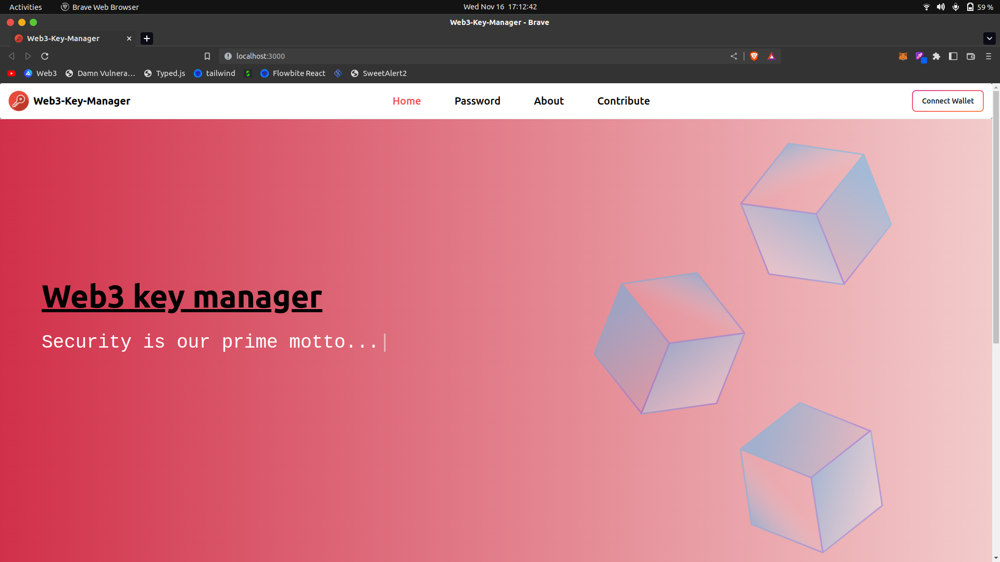
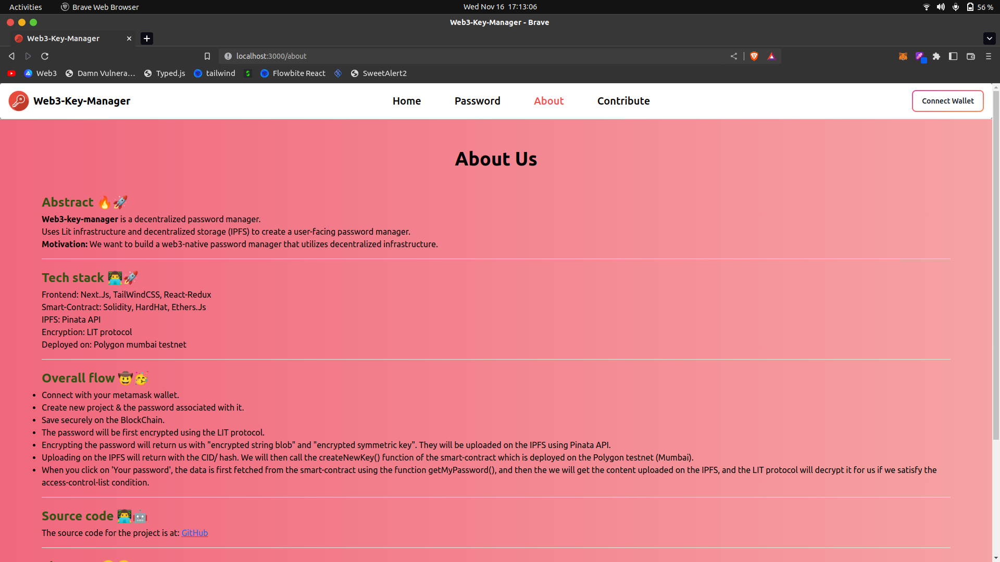
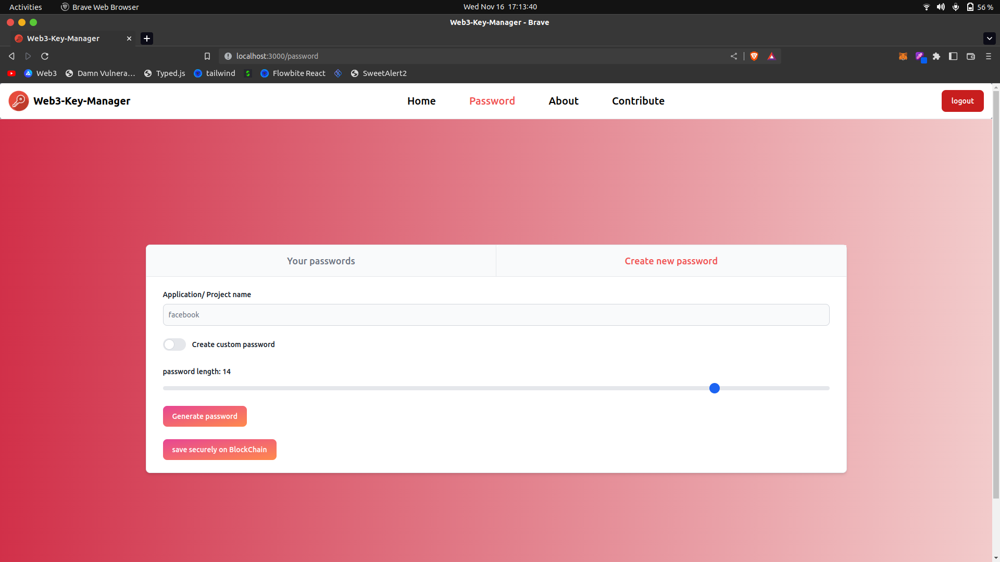
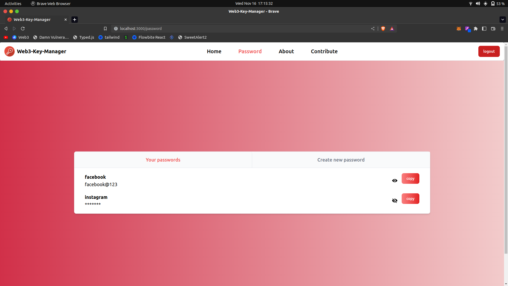

[](readme_resources/web3key.mp4)
## click on the pic to watch video of the project ☝️

# W3b3-Key-Manager 🔥🚀

## (A decentralized password manager)
This project was made for **'EarnWeb3'**, which is being conducted by **['LearnWeb3'](https://learnweb3.io/)**. 
➤ Web3-key-manager is a decentralized password manager.
➤ Uses **Lit infrastructure** and **decentralized storage (IPFS)** to create a user-facing password manager.
➤ **Motivation**: We want to build a web3-native password manager that utilizes decentralized infrastructure.

---
## Tech-stacks used 👨‍💻🚀

- **Frontend**: Next.Js, TailWindCSS, React-Redux
- **Smart-Contract**: Solidity, HardHat, Ethers.Js
- **IPFS**: Pinata API
- **Encryption**: LIT protocol
- **Deployed on**: Polygon mumbai testnet

---
## Project

- **'Home page'** 




- **'About'** page is about what the whole project is about, and what our community stands for.
  

- 'Connect with your metamask wallet to view '**Password**' page'
  

- **'Create new password'**, here you can give a project name and can either 'generate a strong random password' or 'give custom password'.
  

- **'Check your all password password'**
  


---
- From user's perspective this is it. 
- But, in backend, when the password is uploaded, it is first encrypted and the encrypted string and the encrypted symmetric key both are uploaded on the IPFS (using Pinata APIs). 
- They return us with the IPFS hash, and then that hash along with project name is stored on the blockchain (mumbai testnet).
---

## Source code of the project:
[Web3-Key-Manager](https://github.com/deependujha/web3-key-manager)

--- 
## Note: If you are trying to setup this project, then:
``` js
npm i  // if doesn't works use below command
npm i -f
```

#### Thanks.